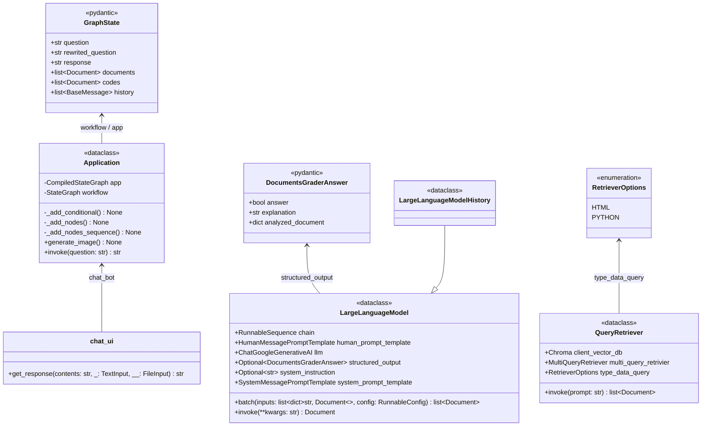

# 1. chatbot_agent

Este projeto é um chatbot desenvolvido para ajudar programadores a entender bibliotecas Python criadas internamente por uma equipe, que não estão disponíveis em repositórios públicos como o PyPI.

Esse cenário é comum em empresas que desenvolvem soluções próprias para demandas internas. Novos membros podem ter dificuldades para se familiarizar com essas bibliotecas. O chatbot foi criado para ajudar nessa adaptação.

O sistema usa RAG (*Retrieval-Augmented Generation* ou Geração Aumentada por Recuperação) para buscar informações no banco de dados vetorial ChromaDB. Essas informações, que são o código e a documentação das bibliotecas internas, são anexadas à pergunta do usuário, dando o contexto necessário para que o chatbot consiga responder.

Tecnologias e ferramentas utilizadas:
- [UV](https://docs.astral.sh/uv/): gerenciamento de dependências e qualidade do código do projeto;
- [LangGraph](https://reference.langchain.com/python/langgraph): framework para gerenciar o estado da aplicação e orquestrar as etapas de geração da resposta;
- [Panel](https://pypi.org/project/panel/): biblioteca para criar a interface web do chatbot;
- [ChromaDB](https://github.com/chroma-core/chroma): banco de dados vetorial para armazenar e buscar as informações (RAG) sobre as bibliotecas internas.

# 2. Preparação do ambiente

Passo a passo para preparar o ambiente:

- Instale o **Python** pela Windows Store ou seguindo as instruções em [python.org](https://www.python.org/downloads/);
- Instale o **uv** rodando `pip install uv`;
- Clone o repositório do projeto com `git clone https://github.com/rafaelpbaptista-cwb/chatbot_agent.git`;
- Entre no diretório do repositório e instale as dependências rodando `uv sync`.

# 3. Detalhes da aplicação

## 3.1. Fluxo LangGraph

Esta seção descreve o fluxo LangGraph do chatbot. A imagem abaixo mostra a implementação:


Detalhando as etapas:

### 3.1.1. Fluxo principal

Etapas principais do aplicativo.

#### 3.1.1.1. Reescrita do questionamento do usuário (rewrite_question)

Esta etapa reescreve a pergunta do usuário para melhorar a busca de informações no RAG.
Isso é necessário para manter o contexto da conversa, já que o usuário frequentemente faz referência a mensagens anteriores. Para o RAG funcionar bem, a pergunta precisa conter todo o contexto.

Exemplo:
- **Questionamento 1:** Como realizar pesquisas na base de dados de histórico oficial?
- **Questionamento 2:** Quero que vc faça uma pesquisa na sua base de conhecimento, com dados atualizados, para descobrir se a classe mencionada possui informações de preço PLD.
- **Reescrita do questionamento 2:** Como acessar dados de preço de energia PLD usando a classe `MongoHistoricoOficial` da biblioteca `infra_copel`?

#### 3.1.1.2. Recuperação de documentação HTML via RAG (retriever_html)

O sistema busca documentos HTML de funções e classes que possam ajudar a responder a pergunta.
A busca acontece no ChromaDB usando RAG. A classe `MultiQueryRetriever` (de `langchain_classic.retrievers`), junto com uma LLM, gera variações da pergunta inicial. Isso ajuda a trazer mais documentos relevantes.

Exemplo:
- **Questionamento do usuário:** Como realizar pesquisas na base de dados de histórico oficial?
- **Perguntas variantes:**
  - Quais são os métodos para consultar registros históricos oficiais?
  - Como posso encontrar informações no repositório de dados históricos oficiais?
  - Quais estratégias de pesquisa devo usar para navegar nos arquivos históricos oficiais?

#### 3.1.1.3. Avaliação dos documentos HTML recuperados (grader_html_documents)

Avalia se os documentos HTML recuperados via RAG realmente servem para responder a pergunta.

#### 3.1.1.4. Recuperação de código Python via RAG (retriever_python)

Mesma lógica da [recuperação de documentação HTML](#3112-recuperação-de-documentação-html-via-rag-retriever_html), mas focada em scripts e arquivos Python.

#### 3.1.1.5. Avaliação dos códigos Python recuperados (grader_python_documents)

Mesma lógica da [avaliação de HTML](#3113-avaliação-dos-documentos-html-recuperados-grader_html_documents), mas para os códigos Python.

#### 3.1.1.6. Geração da resposta (generate)

Gera a resposta final usando os documentos e códigos filtrados nas etapas anteriores.

### 3.1.2. Fluxos de tomadas de decisão

Existem pontos de decisão que definem quais etapas do fluxo principal vão rodar.
Eles são inseridos no LangGraph pelo método `add_conditional_edges` da classe `langgraph.graph.StateGraph`.

Exemplo:

```python
from langgraph.graph import StateGraph
# ...
workflow = StateGraph(<APP_STATE>)

workflow.add_conditional_edges(
      <PONTO_DECISAO_NO>,
      <FUNCAO_AVALIADORA>,
      {True: <NO_1>, False: <NO_2>},
    )
```

#### 3.1.2.1. Reescrita da pergunta vs. Uso do histórico do RAG

Avalia se os documentos recuperados antes (no histórico do RAG) já são suficientes para responder a pergunta atual, evitando uma nova busca. Utiliza o histórico de HTML, de códigos Python e de respostas.

#### 3.1.2.2. Recuperação de código Python vs. Geração da resposta

Verifica se a documentação HTML recuperada em `retriever_html` já basta para responder ao usuário. Se sim, pula a busca por códigos Python e vai direto gerar a resposta.

## 3.2. Detalhamento técnico

### 3.2.1. Diagrama de classes

O diagrama abaixo mostra as principais classes e como elas se relacionam:



### 3.2.2. Descrição das classes e relacionamentos

- **chat_ui**: No script `chatbot-ui.py`, é a interface da aplicação. É o ponto de entrada do programa que interage com o usuário e aciona a classe `Application`.
  
- **Application**: Classe central que orquestra todo o fluxo do LangGraph (`StateGraph`). Configura os nós do fluxo principal e das tomadas de decisão. Tem dois métodos públicos:
  - `invoke`: Recebe a pergunta e executa o fluxo da aplicação na propriedade `app`.
  - `generate_image`: Gera uma imagem ilustrando o grafo do LangGraph.

- **LargeLanguageModel** e **LargeLanguageModelHistory**: A `LargeLanguageModel` interage com a LLM para tarefas como avaliar documentos ou decidir fluxos. A `LargeLanguageModelHistory` estende ela, adicionando a capacidade de injetar o histórico de mensagens. Ambas aparecem em quase todas as etapas do fluxo principal, mudando apenas a instrução de sistema (`system_instruction`).

- **QueryRetriever**: Faz a recuperação de contexto no ChromaDB (RAG). Usa variações da pergunta para buscar os documentos mais relevantes, montando o contexto para a LLM.

- **RetrieverOptions**: Um *Enum* usado pela `QueryRetriever` para definir o que vai ser buscado. Tem as opções `HTML` e `PYTHON` para guiar a busca nas respectivas etapas.