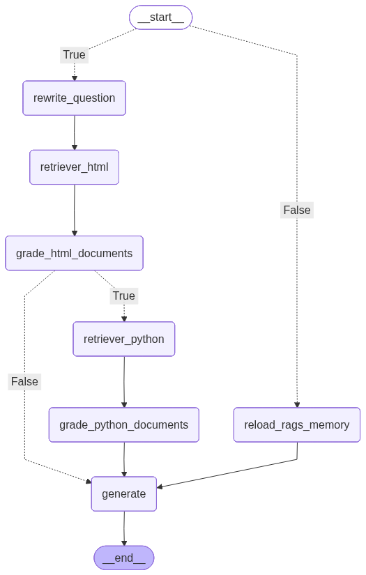

# 1. chatbot_agent

Projeto de um chatbot para auxiliar desenvolvedores a entender bibliotecas python desenvolvidas internamente por uma equipe, onde tais bibliiecas não estão disponíveis externamente via pypi ou outros repositórios.
Esse cenário geralmente ocorre em empresas onde um equipe de desenvolmento cria soluções para atender a demanda interna. Novos membros da equipe podem ter dificuldades para entender essas bibliotecas já criadas. Para auxilia-los nesse processo de adpação, foi criado esse chatbot.

O chatbot utiliza o mecanismo de RAG, Retrieval Augmented Generation ou em portugês Geração Aumentada por Recuperação, para recuperação de informações, utilizando o banco de dados vetorial ChromaDB. Essa informação está relicionada as bibliotecas internas onde gostariamos de obter esclarecimentos. As informações obtidas são anexadas ao questionamento do usuário e dessa forma o chatbot consegue responder aos questionamentos do usuário.

A solução utiliza das seguintes tecnologias e ferramentas:
- [UV](https://docs.astral.sh/uv/): gerenciamento das dependências e qualidade do código do projeto;
- [Langraph](https://reference.langchain.com/python/langgraph): framework para auxiliar no gerenciamento do estado da aplicação e orquestração das etapas envolvidas na geração da resposta ao usuário;
- [Painel](https://pypi.org/project/panel/): biblioteca para a geração da interface web para a interação com o chatbot.
- [ChromaDB](https://github.com/chroma-core/**chroma**): banco de dados vetorial para armazenamento e recuperação das informações (RAG) relacionadas as bibliotecas internas.

# 2. Preparação do ambiente

Segue passo a passo para a preparação do ambiente de execução:

- Instalar **python** usando Windows Store ou seguindo as instruções de [python.org](https://www.python.org/downloads/)
- Instalar **uv** através do comando `pip install uv`
- Clonar repositório do chatbot através do comando `git clone https://github.com/rafaelpbaptista-cwb/chatbot_agent.git`
- No diretório do repositório, instalar as dependências do projeto usando o comando `uv sync`

# 3. Detalhes da aplicação

## 3.1. Fluxo langraph

Nesta seção iremos descrrver as etapas contidas no fluxo langraph do chatbot.
Abaixo segue imagem demonstrando o fluxo langgraph implementado:



Iremos detalhar cada etapa.

### 3.1.1. Fluxo principal

Detalharemos as etapas do fluxo principal do aplicativo. 

#### 3.1.1.1. Reescrita do questionamento do usuário (rewrite_question)

Etapa de reescrita do questionamento do usuário para recuperação posterior de informações via RAG.
Essa reescrita é necessário para manter o histórico da conversa já iniciada pelo usuário. Muitas vezes o usuário faz alguma referencia à mensagens escritas anteriormente. Para a recuperação eficiente de informações via RAG, às vezes é necessário reescever o questionamento do usuário para mantermos o contexto da conversa.
Segue exemplo de reescrita:

- Questionamento 1: Como realizar pesquisas na base de dados de histórico oficial?
- Questionamento 2: Quero que vc faça uma pesquisa na sua base de conhecimento, com dados atualizados, para descobrir se a classe mencionada possui informações de preço PLD
- Reescrita questionamento 2: Como acessar dados de preço de energia PLD usando a classe `MongoHistoricoOficial` da biblioteca `infra_copel`?

#### 3.1.1.2. Recuperação documentação HTML via RAG (retriever_html)

Etapa de recuperação de documentos HTML de funções e classes que possam auxiliar na geração da resposta ao questionamento do usuário.
Essa etapa utiliza a recuperação RAG na base de dados vetorial ChromeDB.
Essa etapa utiliza a classe `MultiQueryRetriever` do pacote `langchain_classic.retrievers`. Essa classe cria, com a ajuda da LLM, variantes do questionamento inicial do usuário. Isso nos ajuda a melhorar a obtenção da informações via RAG.
Segue exemplo da geração de perguntas variantes:

- Questionamento usuário: Como realizar pesquisas na base de dados de histórico oficial?
- Perguntas variantes:
  - Quais são os métodos para consultar registros históricos oficiais?
  - Como posso encontrar informações no repositório de dados históricos oficiais?
  - Quais estratégias de pesquisa devo usar para navegar nos arquivos históricos oficiais?

#### 3.1.1.3. Avaliação dos documentos HTML recuperados (grader_html_documents)

Etapa que avalia se os documentos HTML recuperados via RAG são relevantes para a resposta ao questionamento do usuário.

#### 3.1.1.4. Recuperação de código Python via RAG (retriever_python)

Mesma lógica da [recuperação de documentos HTML](#312-recuperação-documentação-html-via-rag-retriever_html) mas focada em códigos/scripts Python.

#### 3.1.1.5. Avaliação dos códigos Python recuperados (grader_python_documents)

Mesma lógica da [avaliação dos documentos HTML](#313-avaliação-dos-documentos-html-recuperados-grader_html_documents) mas focada em códigos/scripts Python.

#### 3.1.1.6. Geração da resposta ao questionamento do usuário (generate)

Estapa de geração da resposta ao questionamento do usuário baseado nos documentos recuperados nas etapas anteriores via RAG.

### 3.1.2. Fluxos de tomadas de decisão

Existe alguns pontos de tomada de decisão para avaliar quais etapas do fluxo principal serão executados.

Esses pontos de tomada de decisão dentro do langgraph são inseridos através do método `add_conditional_edges` da classe `langgraph.graph.StateGraph`.

Abaixo segue um pseudo-código de uso do método citado:

```python
from langgraph.graph import StateGraph

workflow = StateGraph(<APP_STATE>)

workflow.add_conditional_edges(
      <PONTO_DECISAO_NO>,
      <FUNCAO_AVALIADORA>,
      {True: <NO_1>, False: <NO_2>},
    )
```

#### 3.1.2.1. [Rescrita do questionamento do usuário](#311-reescrita-do-questionamento-do-usuario-rewrite_question) vs Recuperação do histórico documentos RAG

Verifica se os documentos recuperados anteriormente via RAG, para geração das respostas anteriores, são suficientes para a geração da resposta do questionamento atual do usuário.

Para essa avaliação é usado o históricos de documentos HTML e códigos Python recuperados via RAG e o histórico de respostas.

#### 3.1.2.2. [Recuperação código Python](#3114-recuperação-de-código-python-via-rag-retriever_python) vs [geração da resposta](#3116-geração-da-resposta-ao-questionamento-do-usuário-generate)

Verifica se as documentações HTML recuperadas em [retriever_html](#3112-recuperação-documentação-html-via-rag-retriever_html) são suficientes para a geração da resposta ao questionamento do usuário.